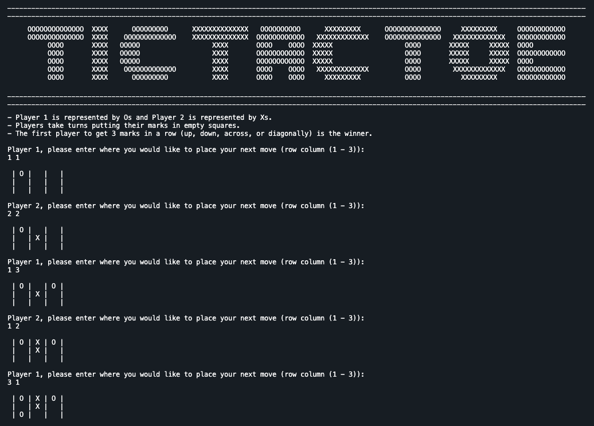

# Tic Tac Toe Game

A Tic Tac Toe game played in the terminal, written in C++.

This was the first small game project built as part of my C++ learning experience.

I wanted to use this project to apply some of the C++ topics I have learned from a course. These include:

- loops
- vectors
- functions
- Header files




## Installation and Setup Instructions

Make sure you have a C++ compiler installed. For example G++.

You can check if you have this installed by running the following command which prints the G++ version installed on your system.
```
g++ --version
```

## Run the Game

Compile the files:

```
g++ -std=c++11 tic_tac_toe.cpp tic_tac_toe_fn.cpp
```

Run the game.

```
./a.out
```